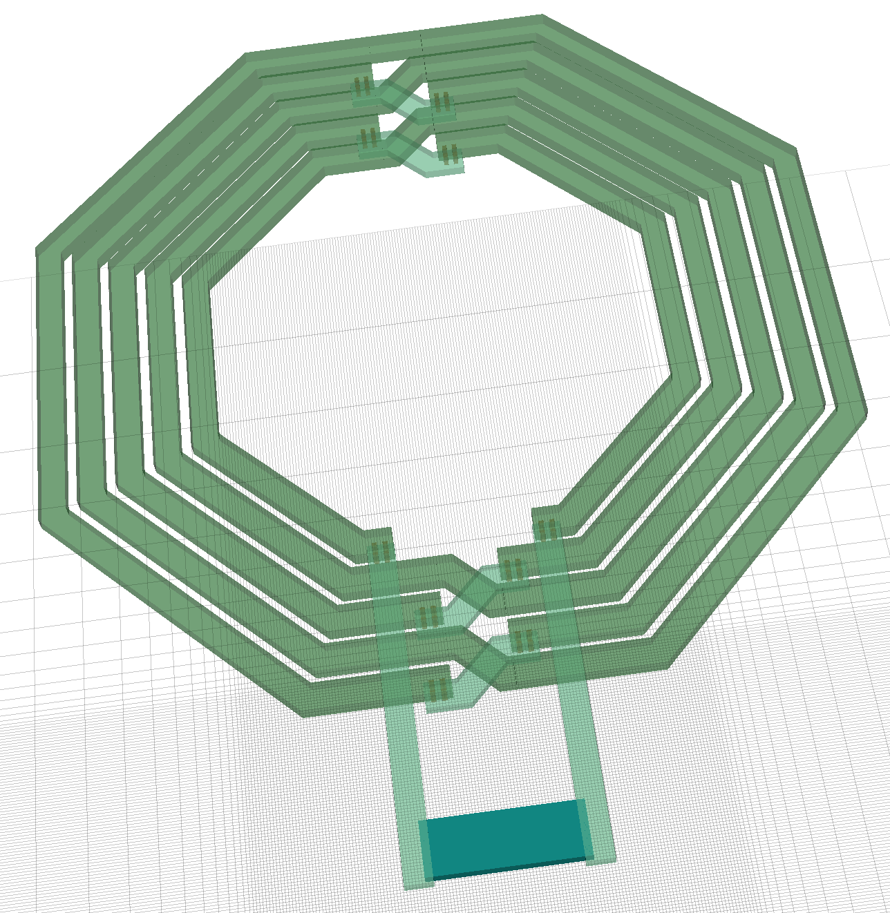
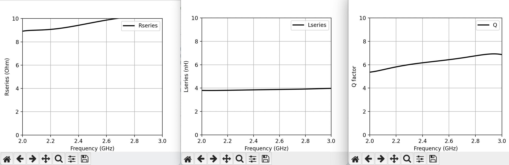

Characterise the inductor (optional)
====================================

We will now use :doc:`../design_softwares/openems` to characterise the inductor drew in :doc:`layout` to verify its
inductance. It is quite important for a LNA to ensure we use the right value for our inductors. However this step can
be long (several hours, even on powerful computers/servers), so if you don't plan to manufacture your design and/or use
the exact same value, you can skip this part.

Generate GDS polygons
---------------------

We need to convert our previously generated GDS into a format compatible with OpenEMS. Here we will use python, but
the IHP Open PDK also offers some script to generate a Octave/Matlab code instead of python.

Move to the ``~/microelectronics/PDK/IHP/IHP-Open-PDK/ihp-sg13g2/libs.tech/openems/import_GDSII`` and run:

.. code-block:: shell

    python3 gds2pythonpoly.py ~/microelectronics/projects/test_inductor.gds 

This will generate a file ``test_inductor_polygons.py`` that contains the geometry of our inductor in python format for
the OpenEMS flow. Move it to your ``projects`` folder:

.. code-block:: shell

    mv ~/microelectronics/PDK/IHP/IHP-Open-PDK/ihp-sg13g2/libs.tech/openems/import_GDSII/test_inductor_polygons.py  ~/microelectronics/projects/

Preparing simulation
--------------------

Now create a new "scripts" folder in tools :

.. code-block:: shell

    mkdir -p  ~/microelectronics/tools/scripts

And download the scripts ``ihp_openems_simu.py`` and ``ihp_openems_mat_const.py`` in that directory:

.. code-block:: shell

    wget ... TODO from gist or something... -O ~/microelectronics/tools/scripts/ihp_openems_simu.py
    wget ... TODO from gist or something... -O ~/microelectronics/tools/scripts/ihp_openems_mat_const.py

These scripts allow you to simulate a gds with OpenEMS using IHP's materials parameters. The only things you have to
specify with this script, the python file of the input layout (in our case it will be ``test_inductor_polygons.py``) 
and the simulation port. You can run the simulation with the bare minimum like this:

Starting 1-port simulation
--------------------------

To run the simulation run the downloaded script like this:

.. code-block:: shell

    python3 ihp_openems_simu.py -P tm1:-14,0,14,10:x:50 test_inductor_polygons.py

| A port is specified with the parameter ``-P`` like this:
| ``Material : Lower Left X, Lower Left Y, Upper Right X, Upper Right Y : Direction : Impedance``
| In our case, the pins of the inductor is in TopMetal1, so the port will be in the same material: ``tm1``.
| For the the points of the port, we use the points we found in the layout: ``(-14, 0)`` and ``(14, 10)``, you only
    have to adapt this on your side.
| The port will propagate following the ``x`` axis and we use a ``50`` Ohm port.
| ``test_inductor_polygons.py`` is the path to the file we want to simulate.

If you want to know more about the script and its parameters you can run:

.. code-block:: shell

    python3 ihp_openems_simu.py --help

By default, the simulation will use a 1um resolution mesh, and simulate form 0Hz to 30GHz.

After you ran the command, you will see a window will open with a preview of your layout, you will also see the port.
This will allow you to verify it is well placed. You should have something like this:

Then you can close this window, which will start the simulation. If you realised your port (dark green box on the image
above) was wrongly placed, you can cancel the simulation with the keyboard keys ``Ctrl`` + ``C``. If you only want to
see the preview without running the simulation, you can add the parameter ``-v`` to the previous command.

Once the simulation has started, it will certainly take several hours depending on the parameters you set, the
complexity of your layout and the performance of your computer. At the end of the simulation you will have something
like this:

.. code-block:: text

    [@ 18h56m29s] Timestep:      6918093 || Speed:   33.3 MC/s (9.807e-03 s/TS) || Energy: ~6.77e-21 (-38.58dB)
    [@ 19h06m08s] Timestep:      6977222 || Speed:   33.3 MC/s (9.801e-03 s/TS) || Energy: ~2.28e-21 (-43.31dB)
    [@ 19h15m48s] Timestep:      7036351 || Speed:   33.3 MC/s (9.805e-03 s/TS) || Energy: ~7.24e-23 (-58.29dB)
    Time for 7036351 iterations with 326430.00 cells : 69348.59 sec
    Speed: 33.12 MCells/s

Visualising results
-------------------

.. TODO: adapt to a newer version of the script which simplify results plotting

To open the results you can simply use the same command as before but with adding the parameter ``-p``: 

.. code-block:: shell

    python3 ihp_openems_simu.py -P tm1:-14,0,14,10:x:50 test_inductor_polygons.py -p

In your terminal you will have something like this:

.. code-block:: text

    Frequency [GHz]: 2.45
    Series L  [nH] : 3.8582205280749458
    Series R  [Ohm]: 9.532990303191587
    Q factor       : 6.230226688478917
    ----------------
    L_DC      [nH] : 3.8024062009152657
    R_DC      [Ohm]: 8.91215940806006
    Peak Q         : 6.924194376059975

And 3 windows will open, with graphicals results of your simulation for the Q-factor, the inductance and the resistor
of your inductor. You should have something like this:

With the text result in the terminal, we can see that at 2.45 GHz, our inductor as a value of ``3.86nH``.

The results are taken from the directory ``sim_out/test_inductor_polygons``. If you ran the previous command with ``-p``
as explained, you will find a ``.s1p`` file in this directory. This file will then be used in Qucs-S (or any other
software) to simulate with the "real" inductor behaviour.

