Layout
======

.. What is a layout?
.. -----------------

.. Explain: goal, masks, link to the schematic

.. TODO...

Setting up Klayout
------------------

For the layout part we will use Klayout, if not done yet, check the installation steps of :doc:`../design_softwares/klayout`.
To run it from your terminal use the command:

.. code-block:: shell

    klayout &

But before we can create our first layout, we need to setup klayout to "Edit mode" (by default, it is in "Read mode").
Open the "File" menu in the upper left and open "Setup". In the opened window, go in the "Editing Mode" tab under 
"Application". Then check "Use edting mode by default" and validate with "Ok".

To take the change in account, you have to close and re-open Klayout. Now you should see much more options in the
toolbar.

Instanciate first PCell
-----------------------

Now we can create the layout with "File > New Layout" (press "OK" with default parameters). 

.. TODO: grid to 0.005um

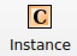

We will first generate an inductor in order to simulate in with OpenEMS to check its inductance at the targeted 2.45GHz.
For that, click on the "Instance" button |klayout_instance_btn|. This will also teach you how to instanciate a PCell,
we will then use the same procedure to add the other components.

This will open an "Editor Options" panel on the lower left part of your screen. In the tab "Instance" write
``inductor2`` in the "Cell" like this:

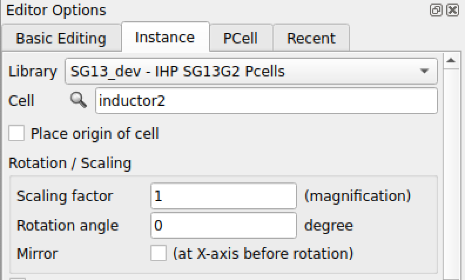

We will now change the parameters of the inductor, in the "PCell" tab as:

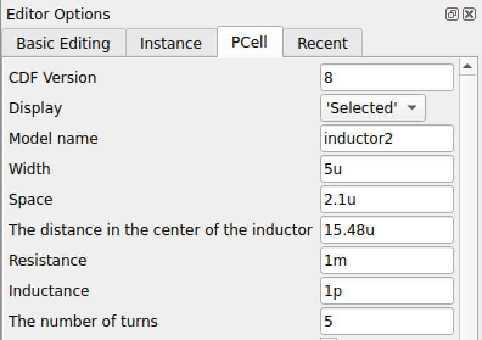

The other parameters are not important and should change the generated layout.
Once the parameters are set, you can click in the visual editor part. You should then see something like this:

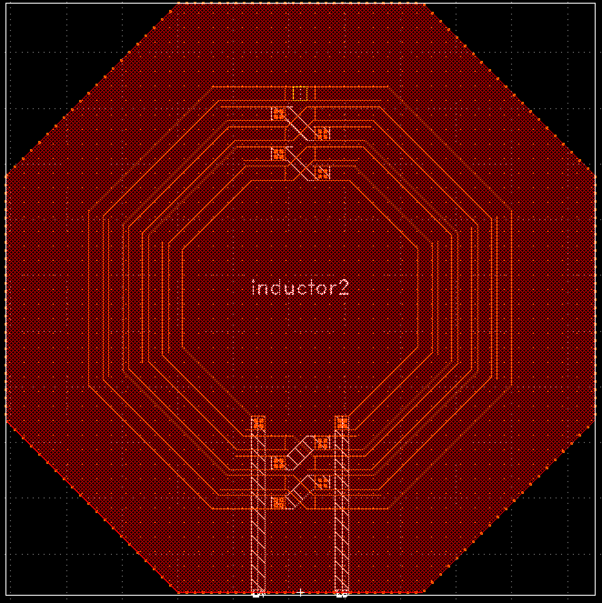

.. note::
  If you see a square with the name of the inductor instead of the actual layout of the inductor, press the key "*" or
  click on "Display" > "Full Hierarchy".
    
Now save ("File > Save") the layout in the directory ``microelectronics/project/layout`` with the name "test_inductor.gds".

Characterise the inductor (optional)
^^^^^^^^^^^^^^^^^^^^^^^^^^^^^^^^^^^^

If you want to characterise this inductor with OpenEMS later, you will need to specify a simulation port. Therefore you
must choose on the layout where to put it. In our case we want to put it at the input and output of the inductor, as 
shown in cyan on the above image. It does not need to be extremely precise, just make sure the port touches both pins 
properly. We need to find the points of these boxes in the layout, for that we use our mouse cursor get its position,
shown in the dark green box of the image above.

We only need the lower left point and the upper right point of the box. With the above layout, we thus have
approximately (-14,0) and (14,10). But this will change for you, depending on where you placed the inductor. Write
down the 2 points you find to use them later with OpenEMS.

You can find the characterisation procedure at :doc:`charac_inductor`.

Instanciating all the PCells
----------------------------

Create a new Layout with "File > New Layout" (press "OK" with the default parameters). And save it with "File > Save" to
the directory ``microelectronics/project/layout`` under the name "LNA.gds" (press "OK" with the default parameters).

We will now use the same process to add all our components to the layout. Make sure you're in "Instance" mode by
clicking on the button |klayout_instance_btn|. In the bottom left panel you can click on the magnifier
|klayout_instance_magnifier|, this will open a window like this:

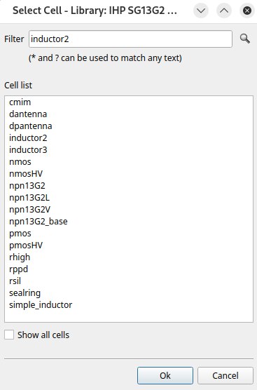

Your window will be slightly different, you might have more or less cells. Make sure you have at least these cells:
cmim, nmos, rhigh, rppd, simple_inductor (or inductor2)

| For the LNA we need 5 ``cmim``, 3 ``nmos``, 1 ``rhigh``,  1 ``rppd`` and 3 ``simple_inductor``.
| Select the component you want to instanciate in the list then click "OK". After that, click in the layout editor as
  many times as you need the component. You might need to dezoom to see something, for this, simply scroll down with
  your mouse.

To add the other components, click again on the magnifier, and start again.

You should have something like that:

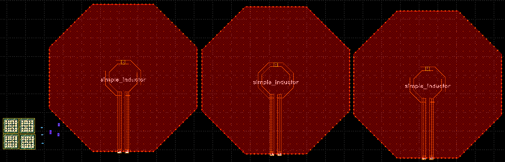

Indeed, the NMOS and resistors are quite small compared to the capacitors, and even worse compare to the inductor. This
will be one of the difficulties to manage with this design.

.. TODO: RF Pads ?

Configuring the PCells
----------------------

Now that we have all the PCells corresponding to our schematic, we need to configure them to match the parameters we 
used in the schematic.

To modify a PCell, you can simply to double click on the targeted PCell. This will open a modal, click on the tab
"PCell parameters". As an example for the capacitor you should have something like that:

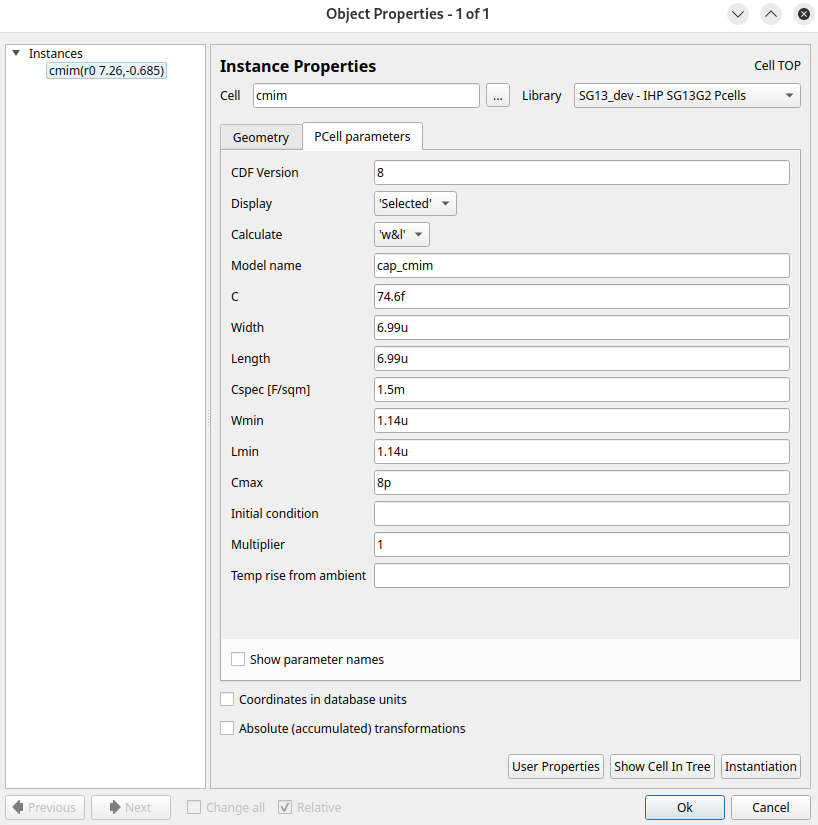

.. note::
  At the moment, PCells have no callback on their parameters to update other values automatically. For example, changing
  the Width of the capacitor should update it "C" field. So we have to calculate them by hand. If you already used
  real components during :doc:`schematic`, then you have to use the same values. Otherwise, see :doc:`schematic` to
  see how to calculate the dimensions.

.. TODO: update link, i'm not sure it is supposed to be :doc:`schematic`
.. TODO: update once callback works

In our case wee will use these values:

Used Parameters
^^^^^^^^^^^^^^^

.. list-table:: Inductors parameters
   :widths: 10 10 10 20 20
   :header-rows: 1

   * - Name
     - Width
     - Space
     - Number of turns
     - Expected value
   * - Ls
     - 5u
     - 2.1u
     - 3
     - ~1.07nH
   * - Li
     - 4.3u
     - 4u
     - 6
     - ~5.92nH
   * - LL
     - 4.6u
     - 4.1u
     - 5
     - ~4.26nH

.. note::
  For the inner diameter or "The distance in the center of the inductor", we leave 0. This will automatically use 
  the minimum diameter.

.. list-table:: Capacitor parameters
   :widths: 10 10 10 15
   :header-rows: 1

   * - Name
     - Width
     - Length
     - Expected value
   * - Cin*
     - 57.74u
     - 57.74u
     - ~5p
   * - Ci
     - 20.53u
     - 20.53u
     - ~632f
   * - Cout 1
     - 29.44u
     - 29.44u
     - ~1.3pF
   * - Cout 2
     - 44.72u
     - 44.72u
     - ~3pF

.. note::
  \*: We instanciate 2 capacitors of 5pF for Cin that we will connect in parallel. An single capacitor of 10pF would be
  to big in layout.

.. list-table:: NMOS parameters
   :widths: 10 10 15 10 15 15
   :header-rows: 1

   * - Name
     - Width
     - Single Width
     - Length
     - Number of Gates
     - Multplier
   * - MPol = M0 = M1
     - 45u
     - 1u
     - 130n
     - 45
     - 1

.. list-table:: Resistors parameters
   :widths: 10 10 15 10 15 15
   :header-rows: 1

   * - Name
     - Type*
     - Width
     - Length
     - Bends
     - Expected value
   * - RPol
     - Rppd
     - 10u
     - 26.17u
     - 0
     - 680Ω
   * - R RF
     - Rhigh
     - 10u
     - 36.62n
     - 0
     - 5kΩ

.. note::
  \*: The different types are different PCells, not an actual parameter.

  The DRM recommends a Width >= 2µm for a better accuracy. We chose a quite bigger width to reduce the mismatch as much
  as we can. Also because even with these dimensions, it's pretty small compared to the inductors.

Once you have configured all your PCells you should end up with something like this:

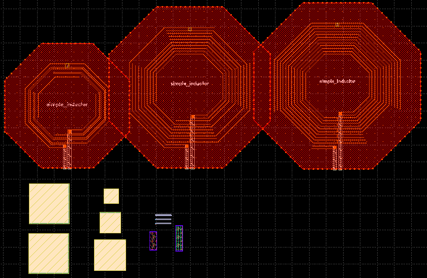

Doing a Floorplan
-----------------

The Floorplan is an very important step in a layout, it is the base of the rest of ower work. A bad Floorplan will
very likely lead to a bad layout.

The Floorplan consist of placing our components to achieve the best compromise between space and performance, while 
taking in account the rules of the DRM and generic global rules. This means we need to keep in mind our schematic.
In general we want to have the shortest traces, because integrated traces are very resistive due to their size.
It is rarely a good idea to try to reproduce the schematic in layout, for instance, this is bad:

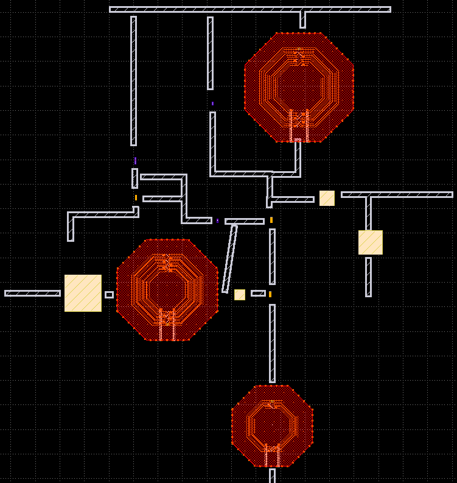

However, it might help to visualise/identify our components. Mostly with not-snynced tools like Qucs-S and Klayout, it
not so easy to see which is which and how to connect them.

| Before we go further, we will explain a little the DRM, Design Rule Manual. This is your layout bible, it tells you
  everything you can do, can't do, have to do in your layout. Each technology/process at its own DRM. IHP's Open PDK
  DRM is accessible at this url: `<https://github.com/IHP-GmbH/IHP-Open-PDK/blob/main/ihp-sg13g2/libs.doc/doc/SG13G2_os_layout_rules.pdf>`_
| For example, if you jump to the section "5.16 Metal1" (page 35) you will have all the design rules for the metal 1: 
  minimum width, minimum spacing...

Hopefully, it is not necessary to read the whole DRM, you should only read the specific section when needed. Also,
the DRC (covered in a next section) will help you find DRM errors, however, it's better to avoid design mistake in
advance, in order to save some time.

The LNA layout is in one hand pretty simple because it has only few components, but in other other hand, the size of
the inductor makes it harder to optimize.

In general, a bloc like the LNA will be part of a bigger chip/bloc, in this case, the shape of the floorplan is
directed by the upper block. In our case, we designed it in standalone, so we don't have to follow anything.
We also have to take the pads in account, in our case we have 2 RF pads for IN and OUT which also embedd VSS and
1 PAD for VDD.

We could align the inductors and put the other devices under, like that:

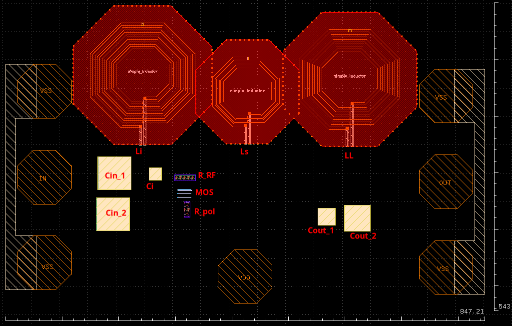

But you can see that there is a lot of unused space in the middle and between around the VDD pad. The text on the pads
are just use as reference to help us visualise, they have no impact for the moment. This floor plan has a size of 
~ 847µm x 543µm, which gives an area of ~ 0.460µm².

If make a less linear floorplan and try to compensate the holes with one of the inductor we can achieve something like
that:

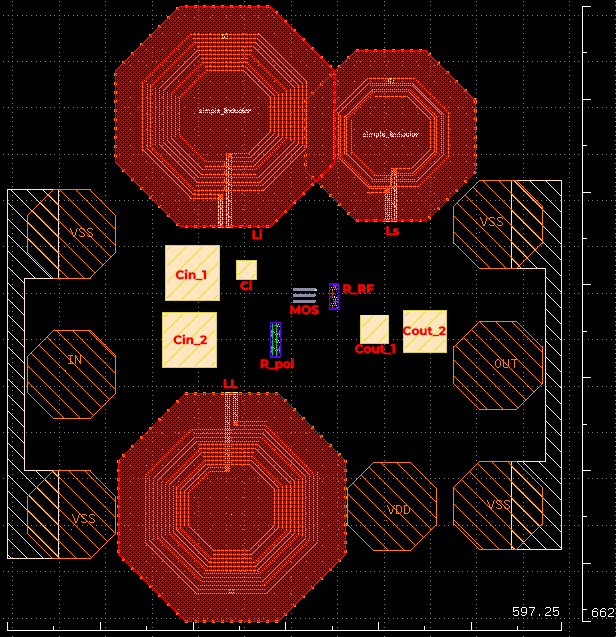

We still have some empty zones, but it's much better, we will stick with this floorplan. We now have an size of 
~ 597µm x 662µm, meaning a surface of ~ 0.395µm².

.. tip::
  It is better to leave bigger spaces between devices during floorplan, it's better to start pessimistic. It's always
  easier to bring devices closer a posteriori than to move away.

Routing and precise placement
-----------------------------

Now that we are happy with our floorplan, we can start the routing.

We generally start with the power rails, here the layout is fairly small so we can keep with only 2 rails, one for 
VDD, and the other for VSS.
According to our floorplan, it's more logical to have the VDD on lower side, close to the VDD pad. And VSS on the
upper side closer to the VSS pads and to the inductor Ls.

During this step we can also join more precisely our devices. We can stick the two Cin capacitors, the inductors...
But we still need to take in account the DRM.

In addition to the power rails, we can also route the importants paths. For instance the input and output traces and
the trace between the output capcitors.

During the routing part, we can also update the floorplan and the general placements according to what we discover.
Here for example, it was actually better to place the VDD pad on the left of the lower inductor. This allows to have
the VDD rail shorter (less parasitic resistance and capacitance) to the devices and the tank inductor closer to the
output.

This give us a layout that looks like that:

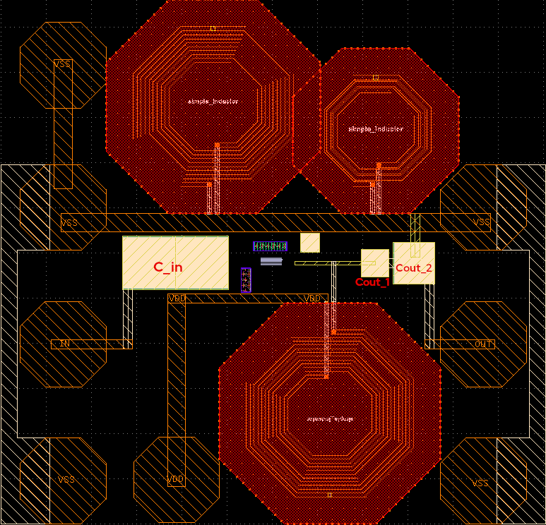

During this step we also reduced the unused space in the middle by putting the input capacitors horizontally.

First DRC
---------

In general, it is a good idea to regularly run a DRC during the layout process. This avoids bad suprises at the end.
Now that we have close components, metal traces... it is a good moment for a first DRC.

In Klayout it is pretty straight forward. You simply have to go in "Tools > DRC" and then click on the
``sg13g2_maximal.lydrc``.

This will run the DRC, you will have to wait a little, then a window will open, you should have someting like this:

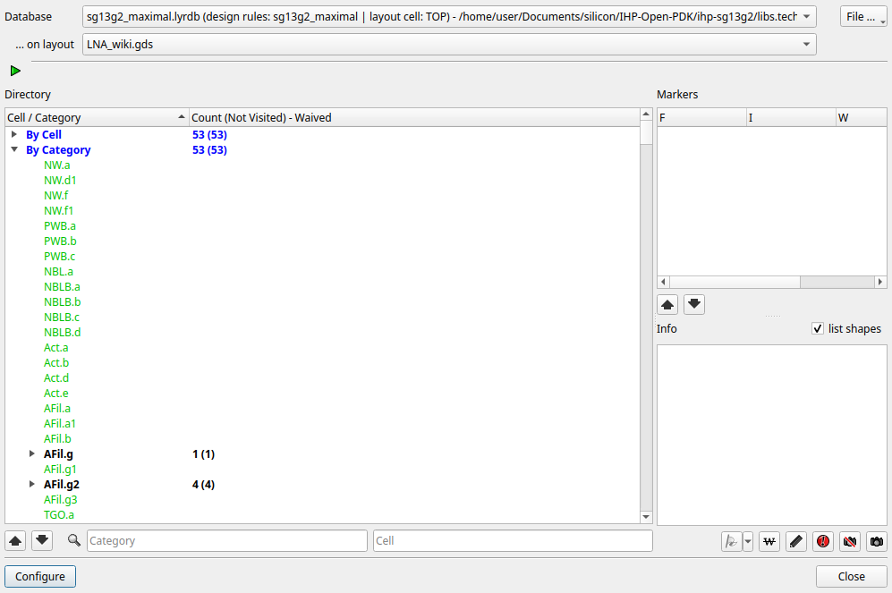

On the picture above, the number 53 represents the number of DRC errors, this number will probably be different with
your layout. Don't panic if the number is very high, sometimes it is the same error repeated several times and is easy
to fix. Detected errors will be in black with the number of encounters on the right, whereas non-present errors will
be in green.

If you scroll through these errors, you will see that they all correspond to a rule in the DRM. A rule is always formed
with the layer first then the reference of the rule, separated by a point. For example if we take ``AFil.g`` we see in
the DRM (p. 24) that ``AFil`` stands for Activ:filler and the ``.g`` refers to a minimum density needed. You will
probably have this error at this point, fillers and density will be covered later. For the moment just ignore minimum
density and coverage they will be fixed at the end of the process, they are often (but not always) referenced as ``.g``,
``.j`` and ``.h``. But take care of maximum density errors, these have to be fix as soon as possible, like other DRC
errors.

The inductors will certainly generate errors like ``OffGrid.XXXXX_nofill`` or ending with ``_block``. For the OffGrid
errors and some other, the layer is given after the point. OffGrid means that we don't respect IHP's 0.005µm
manufacturing grid. For most layers, this is a probably that we need to fix, it would otherwise lead into manufacturing
uncertainties. But here, these layers won't be used for manufacturing, they are only used for the filling and 
design parts, it's the kind of error we can ignore.

.. TODO: verify OffGrid no fill can be waived/ignored

If you have an error that you think is legit and needs to be fixed, you can click on the error (in black). In the DRC
window you will have the markers on the right, you will have one marker per places the error is encountered in your 
layout. You can click on a marker, the Klayout's editor window will zoom to the place the erros was found. You can
then fix it and re run the DRC to make sure you properly fixed it.

Most common DRC errors are min spaces and min enclosures. Every error has it's own fixes, we can't cover all the errors
here, it is just impossible, it depends too much on the layout. The more you will do layouts, the less you will do 
DRC errors beforehand and the easier it will be to fix the errors. So just practice!

.. TODO: sealring

.. TODO: Dummies for mos ?
.. TODO: guard ring for resistors ?

.. TODO: MOS guard ring
.. TODO: filling

.. TODO: finish :)
