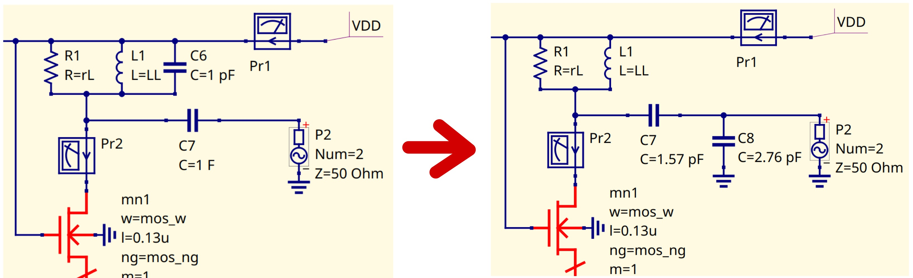

Schematic validation
====================

Setup and Prerequisities
------------------------

The schematic design and the simulations will be made with Qucs-S. Before starting the design, make sure 
that the IHP PDK is properly imported into Qucs-S. The import steps are detailled in 
:doc:`../design_softwares/qucs`.

Transconductance extraction (gm)
--------------------------------

The PDK does not provide details on the electron mobility or on the effective channel length.
The transconductance gm is closely related to the current consumption (Id), noise factor (NF), MOS channel 
width (W) and gate voltage (Vg). Therefore, it is important to run simulations to find the MOSFETs 
transconductance gm that fit our specifications.

Retrieving parameters with a simple MOSFET Circuit
^^^^^^^^^^^^^^^^^^^^^^^^^^^^^^^^^^^^^^^^^^^^^^^^^^

First, we want to find the operating point values (gm, Gds, MOS capacitor values) with a simple circuit 
including a single MOS.

To fetch components parameters coming from the IHP PDK (e.g. Gds or gm), the component SPICE name has
to be specified. This can be done by adding include scripts and equations in the schematic. These scripts 
consists of including MOSFET PDK libraries into the schematic, select the parameters the component and save 
it as a variable to plot it afterwards. Here is an example of scripts :

.. code-block::

    Nutmeg
    variable=@n.xYYYY.x1.nsg13_XXXX[ZZZZ]

    INCLUDE SCRIPT
    SpiceCode= .save all @n.xYYYY.x1.nsg13_XXXX[ZZZZ]
               .save all @n.xYYYY.x1.nsg13_XXXX[ZZZZ]

    INCLUDE SCRIPT
    SpiceCode= .lib cornerMOSlv.lib mos_tt

Here, you can edit the command lines to adjust depending on your instance name (YYYY), its 
type (XXXX) and the wanted parameter (ZZZZ). For example, if we want to retrieve Gds, gm and Cgs of the 
lv_nmos transistor named mn0 in the schematic and the current probe Pr1 :

.. code-block::

    Nutmeg
    gm_mos=@n.xmn0.x1.nsg13_lv_nmos[gm]
    gds_mos=@n.xmn0.x1.nsg13_lv_nmos[gds]
    cgs_mos=@n.xmn0.x1.nsg13_lv_nmos[cgs]

    INCLUDE SCRIPT
    SpiceCode=.save i(VPr1)
    .save all @n.xmn0.x1.nsg13_lv_nmos[gm]
    .save all @n.xmn0.x1.nsg13_lv_nmos[gds]
    .save all @n.xmn0.x1.nsg13_lv_nmos[cgs]

|

The objective is also to find a channel width that makes a good compromise between area, consumption and 
performance. To do so, we plot two charts gm=f(Vgs) and Ids=f(Vgs) and we sweep the W parameter for five 
to ten values to have several number of graphs. By train-error method, we can find the corresponding width 
for our constraints on the current and transconductance. After the channel width is chosen, we sweep the 
gate voltage Vgs to find a good combination between the current consumption Ids and gm with the W fixed.

|

Parameters can be used to define component values. This can be done by adding a .param directive 
in the schematic and specifying the component value. 

.. note::
    To sweep a parameter that is inside a different component than a resistor or power sources (e.g. 
    gate width W), the variable sweep has to select an another parameter sweep in the field "Sim=" as above.

Validating gm with a Cascode Circuit
^^^^^^^^^^^^^^^^^^^^^^^^^^^^^^^^^^^^

As we have an approximate value for the gate voltage, we can complete the circuit with the cascode
MOSFET and the resonator on the top of it. For now, the objective is to verify the gm of our circuit. 
Therefore, we generate the gate voltage with an ideal DC source and sweep the voltage.
For the simulation, an AC power source is added. High value capacitors and inductors are also added to 
ensure that the DC source that generates the gate voltage is not shorting the AC source.

|

After simulation, we apply the same technique as in the single MOSFET circuit to retrieve gm and read the 
charts.

50-Ohm Matching & gate polarization circuit
-------------------------------------------

Degeneration inductor selection (Ls)
^^^^^^^^^^^^^^^^^^^^^^^^^^^^^^^^^^^^

Now that we know what gate voltage is needed to obtain our gm, we can adjust parameters to have the correct 
input matching on our circuit. To do so, we want to find the degeneration inductor value Ls that matches our 
requirements. An S-Parameter simulation at 2.45 GHz and a parameter sweep on the input inductor Ls are 
made to acheive 50 Ohms on the real part Re(Z11) at the input. When plotting the output graphs, we want to 
see Re(Z11) versus frequency for each inductor value sweeped. To make an S-Parameter simulation with Qucs-S
and Ngspice, the software needs to detect at least two AC power sources. Therefore, we put another power
source and isolation components at the output so the port is not interfering with our simulation.

|

While fine-tuning simulation steps and value ranges, we can find an approximate value for the corresponding 
inductor. 

.. important::
    The simulation is made with ideal components. Therefore, you have to choose values that will be the 
    easiest possible to reproduce with a real design (e.g. with parasitics like a resistive part).

Gate MOSFET capacitor tuning for linearity
^^^^^^^^^^^^^^^^^^^^^^^^^^^^^^^^^^^^^^^^^^

To ensure a good amplifier linearity, we have to take a look at the capacitance seen at the input, i.e. the
gate capacitance of the MOSFET. We aim an input Q-factor as low as possible to not degrade linearity. Thus, 
the objective is to increase or not the gate capacitance to find a good Q-factor value. This can be done by 
adding another capacitor between the gate and the source of the MOS. The total capacitance will be equal to 
the sum of the two capacitors : this will result in the decrease of the input Q-factor.

|

Gate polarization circuit
^^^^^^^^^^^^^^^^^^^^^^^^^

The next step will focus on the design and the adjustments of the MOSFET gate polarization circuit. As a 
simple explanation, it consists of another MOSFET and resistors to adjust the polarization voltage. It will 
follow the same template as the input inductor selection. To begin, start to fix a proper channel width for 
the polarization MOS. It should be large enough to drive the cascode. For our case, we took the same size 
as the cascode MOSFETs. |br| |br|
To find the right drain resistor for our circuit, we will sweep the resistor value and plot it versus the 
current Ids and gm. If the resistor value is too big or the gate voltage is too high even with no resistor, 
then you should change the polarization MOS channel width. |br| |br|
After that, the isolation inductance at the input (used as isolation between DC and AC) is no longer needed.

|

Input inductor selection (Li)
^^^^^^^^^^^^^^^^^^^^^^^^^^^^^

Now that we have a proper polarization circuit, we can finalize the input matching by adding a series 
inductor at the input. This will adjust the imaginary part at the input Im(Z11). The inductor value is 
swept until the imaginary part is zero.

|

.. important::
    The simulation is made with ideal components. Therefore, you have to choose values that will be the 
    easiest possible to reproduce with a real design (e.g. with parasitics like a resistive part).

Design of the RLC load
^^^^^^^^^^^^^^^^^^^^^^

To design the RLC load, we don't need the isolation inductor at the output. This can be explained by 
understanding the challenges of the RLC load design :

* The voltage gain Gv is related with the parallel resistance of the RLC load. We must have a Rp value that is sufficiently high to have the highest gain. Depending on the inductor design, this value will determine if we need an additionnal parallel resistor ;
* We would like to have our circuit working at 2.45 GHz. Thus, the LC couple should resonate at this frequency ;
* The capacitor will be primarly used to resonate with the inductor. Later on the design, it will be also used to tune the output impedance.

For our case, we choose a low capacitor value : this will lead to a high inductance value. At first 
glance, it should not be optimal in terms of area. But, when designing it, a high inductance will tend to 
have a noticeable series resistance (high Rp). It means that we might don't need an additionnal parallel 
resistor.

.. note::
    The following step is optional : the output matching of a LNA only depends on the circuit load (e.g. 
    another signal processing circuit e.g. mixer).

To match the output of the LNA, the capacitor in the RLC load can be transformed as a capacitive divider.
This will allow us to tune Re(Z22) and Im(Z22) easily and match the output at 50 Ohms.

The capacitors in the divider are calculated with the following formulas : 

.. math::
    C_s &= (C_0*C_2)/(C_2-C_0) \\
    C_p &= C_L * sqrt(R_L/50)

Adding the capacivite divider also allows us to remove the isolation capacitor at the output (added while 
designing Ls).

|

Gain measuring, noise factor and IIP3
-------------------------------------

Direct gain and voltage gain
^^^^^^^^^^^^^^^^^^^^^^^^^^^^

Now that the circuit is matched, we can measure the gain of it by making an S-Parameter simulation. We 
retrieve the direct gain by writing the following equation to our schematic :

.. code-block::

    Nutmeg
    direct_gain=dB(s_2_1)

By plotting this variable versus frequency, we can retrieve the direct gain at 2.45 GHz. 

|

To measure the voltage gain of the circuit, replace the input power port by an AC power source and a 
50 Ohms resistor. At the output, the power port should be removed. Also, place a voltage probe before the 
capacitive divider. This will retrieve the raw voltage gain of the circuit.
Configure the AC power source to deliver 100 mV at 2.45 GHz so the voltage probe measure corresponds to the 
voltage gain divided by 10.
By making an AC simulation at 2.45 GHz, we can plot the results on a tabular :

|

.. note::
    Here, the resistors in series with the inductors represents the theorical parasitics. The parasitics 
    can be retrieved by designing the inductors in :doc:`charac_inductor`.

Noise factor
^^^^^^^^^^^^

The noise parameters can be calculated by enabling "Noise" in the S-Parameter simulation. Make sure that 
the input and output ports are specified correctly in NoiseIP and NoiseOP. After that, the noise factor 
can be plotted directly in dB.

|

Harmonic balance simulation
^^^^^^^^^^^^^^^^^^^^^^^^^^^

Unfortunately, the harmonic balance simulation is not available with ngspice. Xyce simulator can be used 
to make the simulation. This will mean that the schematic (and the Qucs editor) has to be configured to 
work with Xyce. The configuration steps are detailled in :doc:`../design_softwares/qucs`.

.. note::
    WIP

Simulation with real components
-------------------------------

Now that the circuit is design with ideal components, we want to apply process parasitics and limitations 
to our design. To do so, we have to use the real component models provided by IHP. To import them, the 
following script has to be added in the schematic : 

.. code-block::

    INCLUDE SCRIPT
        SpiceCode= .lib cornerCAP.lib cap_typ
                   .lib cornerRES.lib res_typ

This script will link the real components added in the schematic to the typical component models.

Inductors design
^^^^^^^^^^^^^^^^

Starting the design with inductors liberates from constraints applied by them. It is first due to the fact that the inductances are design with pCells from IHP so they need to be simulated (with openEMS) for each modification. Also, they will have some parasitics (like the series resistance) that can be compensated with the resistors and capacitors in the design. |br|
The inductor design and characterisation is detailled in
:doc:`../design_tutorial/charac_inductor`.

Capacitors design
^^^^^^^^^^^^^^^^^

Once all the inductors in the circuit are chosen, the capacitors can be used to adjust the matching according 
to the new inductors. We first tune the capacitors value to have good specifications again. After that, we 
can use the MIM capacitor real model. |br|
The process formula provided by IHP for MIM capacitors is used to design them : 

.. math::
    Area Capacitance = (C_{measure}/Area)

We are assuming that the capacitors are following a square shape. It allows us to put the same dimensions 
in width and length. 

Resistors design
^^^^^^^^^^^^^^^^

The IHP PDK provides three different resistor models depending on their value and precision. All three 
models have the same formula to calculate the resistor length : 

.. math::
    W &= {fixed} \\
    L &= (R*(W+deltaW))/R_{sheet}

To find a good resistor value, fix a resistor width first. Then, depending on the model, retrieve the sheet 
resistance and line width delta. With these three values the resistor length can be calculated.

Specifications validation with real components
^^^^^^^^^^^^^^^^^^^^^^^^^^^^^^^^^^^^^^^^^^^^^^

Now that every component in the design is coming from the PDK or is from a simulation result, we must 
validate the specifications by making a S-Parameter simulation. The matching, the gain and the IIP3 
should be verified. Unfortunately, the SPICE simulators used cannot retrieve the noise factor when .s1p 
components (output simulation files that model real inductors) are included in the schematic.

(End of document)

..
    Files
    -----
    TODO
    Add netlist files? Or .sch files for Qucs directly?

.. |br| raw:: html

     